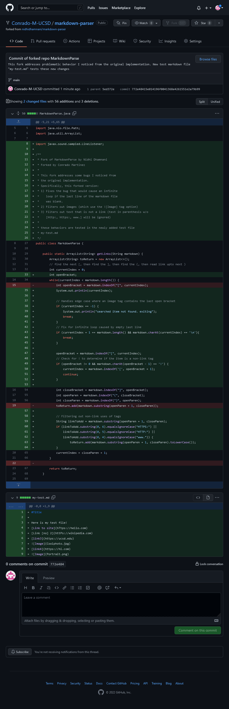

# Lab Report 2 (Week 4) 
CSE 15L SP22

### So what did I change? 
Changes were made to combat 3 problematic symptoms:
- Markdown files with an empty newline at the end would cause an infinite loop
- Images in markdown files would also be added
- Any type of text that's inside parentheses will be treated as a link

[Here's the test file](https://github.com/Conrado-M-UCSD/markdown-parser/blob/main/test-file.md) created to test this new functionality.

### What bugs caused these symptoms?
The first priority was getting the program to run with the provided "test-file.md". After adjusting the file to remove the empty last line, the program worked! Since it's likely that many markdown pages will have an empty last line, I needed to find a way to allow the progam to run when they are present. The change here involves ending the infinite search for brackets by looking for a newline when index reaches the end of the file length. 

The other two were more of an individual implementation decision, but I figured making these changes makes sense, since a user may want to add this to an automated system that relies on being constistently provided with valid URLs. To make these changes, I check the character before the opening bracket to determine if an image is found. If an '!' is not found, the program checks the contents of the supposed URL for a URL scheme (https,http, www). If one is found, the link is later returned. 

**Here's the diff of MarkdownParse.java**

