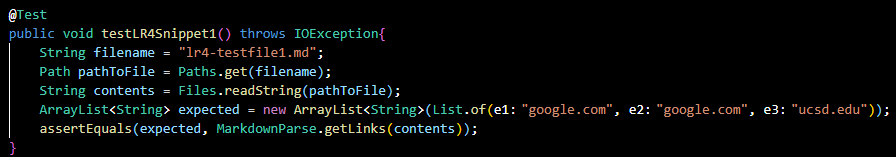
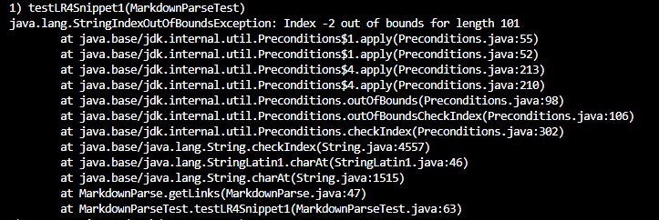
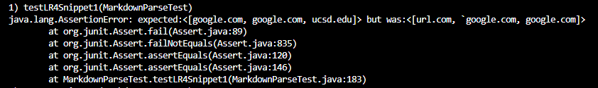
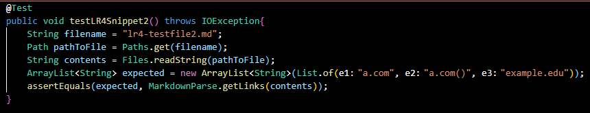
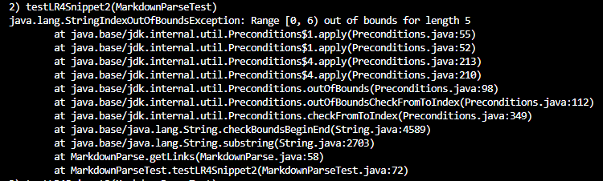
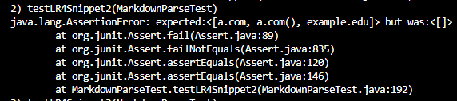
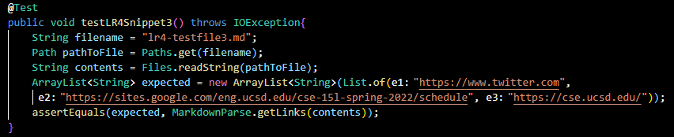
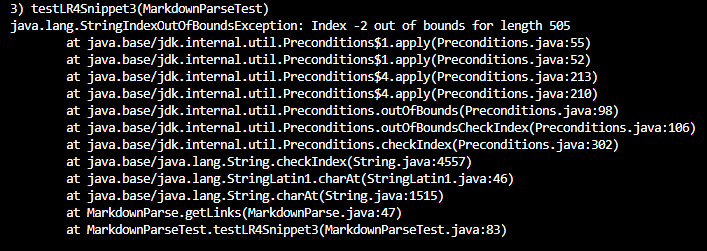
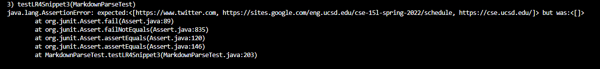

[Return to Homepage](https://Conrado-M-UCSD.github.io/CSE15L-Lab-Reports/index.html)
# Lab Report 4: Testing Implementations of MarkdownParse

## Running snippets

I will test my implementation of MarkdownParse as well as the implementation my group reviewed as part of Lab 7. Here are the results! 

My implemention can be found [here](https://github.com/Conrado-M-UCSD/markdown-parser).

The implementation that was reviewed for lab 7 can be found [here](https://github.com/anhthony/markdown-parser).

___

## Test 1: 

**Snippet:**

**Test method:**

Expected links parsed: 

* google.com
* google.com
* ucsd.edu

Results of my implementation: __n/a (indexOutOfBounds)__

Results of reviewed implementation: 

___

## Test 2: 

**Snippet:**

**Test method:**

**Expected links parsed:**

* a.com 
* a.com
* example.com

Results of my implementation: __n/a (indexOutOfBounds)__

Results of reviewed implementation:  

___

## Test 3: 

**Snippet:**

**Test method**

Expected links parsed: 

* https://www.twitter.com/
* https://sites.google.com/eng.ucsd.edu/cse-15l-spring-2022/schedule
* https://cse.ucsd.edu/

Results of my implementation: __n/a (indexOutOfBounds)__

Results of reviewed implementation: 

___

## Reflecting on the Results

Since the results produced by my implementation were problematic, I began considering ways that I could correct this issue. Based on the provided exception, I knew that some issue was causing the index -2 to be searched.

__Q1:__

At the moment, I don't know of a small fix that can fully resolve my issue. I did prevent the indexOutOfBounds exception by checking the element's index before continuing any searches. If an element was found to have a negative index, the program ends execution immediately. This does lead to the returned list of links being null though. If I do find a way that this can be addressed by the resubmission deadline, I'll be sure to add the changes. 

__Q2:__

I couldn't find a way to resolve my index out of range issue. Since this issue was drastically differs from the others with a simple indexOutOfBounds exception, I feel the fix would be more complex. If I do find a small solution that fixes this issue, I'll update my code to implement this fix. 

__Q3:__

I wasn't able to determine an easy fix that fully fixed my issue. Like with test 1, I was able to eliminate the indexOutOfBounds issue, but was not able to have the correct list of links returned. I would previously get exceptions whenever one of the searched for items was not on the current line. Since the index would be -1, Searching for the element before this index would lead to the program searching at index -2. If I discover a fix to the issue, I'll submit it as part of my regrade and upload my repo to reflect the new changes. 
