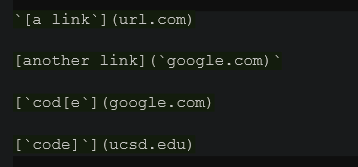
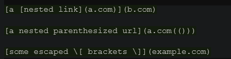
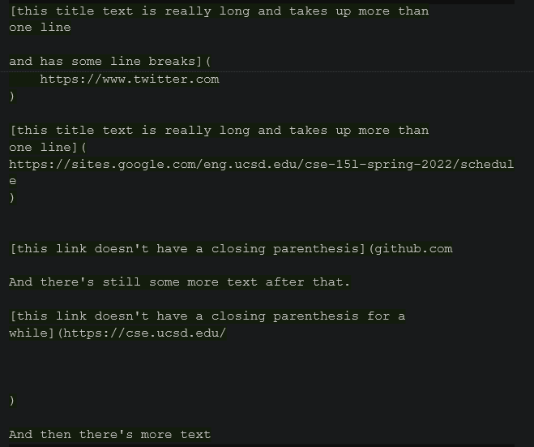

[Return to Homepage](https://Conrado-M-UCSD.github.io/CSE15L-Lab-Reports/index.html)
# Lab Report 4: Testing Implementations of MarkdownParse

## Running snippets

I will test my implementation of MarkdownParse as well as the implementation my group reviewed as part of Lab 7. Here are the results! 

My implemention can be found [here](https://github.com/Conrado-M-UCSD/markdown-parser).

The implementation that I tested in lab 7 can be found [here](https://github.com/anhthony/markdown-parser).

__Test snippet 1:__ 

__Test Snippet 2:__

__Test Snippet 3:__ 

