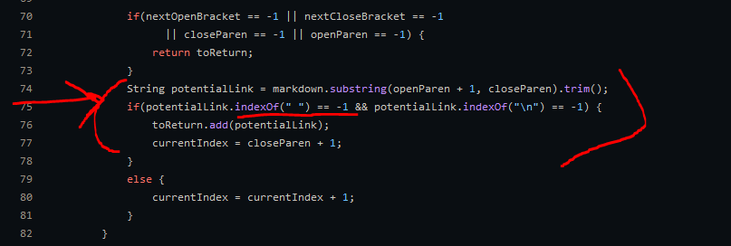
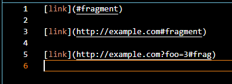
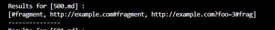
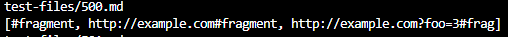

[Return to Homepage](https://Conrado-M-UCSD.github.io/CSE15L-Lab-Reports/index.html)
# Lab Report 5: Exploring Bugs and Their Causes

Now that we've practiced using JDB to diagnose problems in code, we can apply these techniques to the output of markdown parser's test files. We'll be comparing the output of the [original implementation](https://github.com/nidhidhamnani/markdown-parser) with the output of [my group's implementation](https://github.com/richmass1/markdown-parser). Out of the 652 total tests provided with MarkdownParse, I have hand-picked 2 that we'll explore here. 

My method for selecting tests to examine involved adding a small conditional to the MarkdownParse main method. Specifically, I look for an args[0] = "-d" to denote a directory is being passed to method. Then, args[1] is the directory containing test files. Then, we run the test with each .md file in the diretory. The parsed links are then printed after each test is run. This solution for my group's implementation while I just ran the example implementation via IENG6 and the provided script.sh file, which printed the results. 

## First Test: 567.md

__Input:__

__Output from my group's implementation:__

__Output from example implementation:__

In this example, I feel that the example implementation is correct. Although the text parsed by my group's implementation was inside of parentheses, it isn't a valid link and shouldn't have been parsed. This is based on the file's vscode preview that shows a completely broken link. In this case, the problem with the code in our code seems to be a limited filtering of potential links. Filtering could be done in a wide range of ways to accomplish different goals, but regardless of the goals of an implementation, it shouldn't parse the text "not a link". We can see that the example implementation filters this potential link out by checking if a link contains spaces. Since no valid links can contain spaces, the text ends up being omitted. Here is the code responsible for filtering the text: 

## Second Test: 500.md

__Input:__ 

__Output from my group's implementation:__

__output from example implementation:__

In this example, I feel that both implementations provided output based on my interpretation of the program's goal. Since I would expect it to parse ONLY links, the #fragment as the first element would be invalid. However, it makes it into our implementation's output since it's text that's encased in parentheses after a set of brackets. It also makes it inot the example implementation's output since it meets the criteria outlined above and also doesn't contain any spaces. Since I can't outline a problematic section of code responsible, I will suggest changes that would align with my interpretation of the instructions. 

After the text we assume to be a link is separated from the rest of the text on that line, we can only allow it to be part of the output if running .contains(`".xzy"`) where xzy is some valid extension. Here, we could create an array and define the valid extensions we want to parse. If we exclude file extensions from our whitelist, we can also prevent parsing of any filenames which I would interpret as part of the goal as well, since the parsed text wouldn't lead back to a local file. I specifically see parsing text like this to be a potential issue if the output is directly fed into another program that needs a list of links. In that case, it seems most beneficial to take care of any filtering within the parser. 